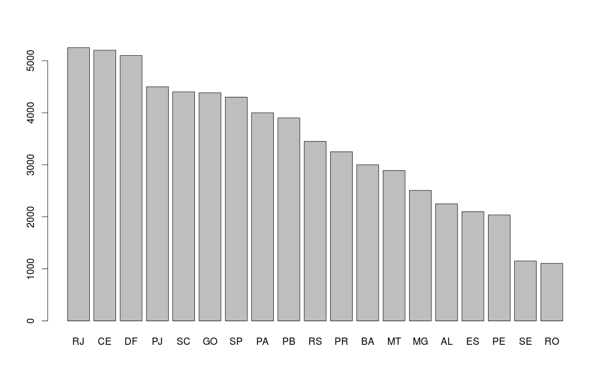

#Descrição dos dados: 
Os dados foram coletados através de um formulário no google. Tais dados contem informações sobre o salário e outras informações à respeito de algumas profissões de TI no Brasil. Ao todo foram coletados 162 obervações com 12 variáveis cada. Na figura abaixo, é possivel visualizar uma pequena amostra dos dados.

```{r}
salariosTI <- read.csv("salarios-ti-refinado.csv")
head(salariosTI[,c(2,3,4,6,12)])
```
Para uma melhor visualização, algumas colunas/variáveis foram cortada da figura acima, contudo todo o conjunto de colunas/variaveis podem ser vistas abaixo:

```{r}
colnames(salariosTI)
```

Antes de se fazer uma análise mais aprofundada nos nossos dados, é sempre de bom tom procurar por uma ou mais observações estranhas ou fora do padrão. Seguindo tal conceito, é possível notar que uma da observações apresenta uma comportamento um tanto peculiar à respeito da variável Salario Bruto. 

```{r}
plot(salariosTI$Salario.Bruto)
```

O gráfico acima apresenta todas as observações da variável "Salario.Bruto". É possível notar que a grande maioria dos dados esta dentro de um determinado "range", contudo existe uma observação que apresenta um comportamento bastante diferenciado, onde a mesma se encontra isolada na parte superior do gráfico. Tal observacao, esta ligada a algum profissional que tem um salário bruto maior do que R$40,000 reais. Por apresentar tal comportamento, essa observacão é chamada de "outlier".

Um bom analista de dados deve ter cuidado com outlier's, pois dependo da pergunta que é feita ao seus conjunto de dados, os outlier's podem influenciar a sua resposta de uma maneira errônea. Assim sendo, é aconselhável usar estratégias que possam dimunuir ou eliminar a influência dessas observações.


#Consultando os dados

Com esses dados em mãos, nós podemos tentar responder algumas perguntas, como por exemplo:

__Em qual estado e em qual região estão os melhores salários para profissionais de TI?__  
  
Resposta: Para responder esta pergunta, primeiro precisamos filtrar os dados por estados e para cada estado calculamos a mediana da variável "Salario.Bruto". Eu escolhi usar a mediana, porque a média nesse caso não seria uma medida representativa para o conjunto, pois a mesma é, facilmente, afetada por outlier's.

```{r}
#O código abaixo filtra e recupera a mediana dos salários por estados,onde por fim será gerado um gráfico de barras.
estados <- levels(salariosTI$UF)
estados_salario <- sapply(estados,function(estado){
  salario_estado <- salariosTI[salariosTI$UF == estado,]
  median(salario_estado$Salario.Bruto)
}) 

estados_salario <- as.data.frame(estados_salario)
estados_salario <- cbind(Estados = rownames(estados_salario), estados_salario)
colnames(estados_salario)<- c("Estados","Media_Salarial")
estados_salario<-estados_salario[order(-estados_salario$Media_Salarial),]
rownames(estados_salario) <- NULL
```



```{r}
#O código abaixo filtra e recupera a mediana dos salários por regiões,onde por fim será gerado um gráfico de barras.

regioes <- levels(salariosTI$Regiao)
regioes_salarios <- sapply(regioes, function(regiao){
   salario_regiao <- salariosTI[salariosTI$Regiao == regiao,]
   median(salario_regiao$Salario.Bruto)
 })

regioes_salarios <- as.data.frame(regioes_salarios)
regioes_salarios <- cbind(Estados = rownames(regioes_salarios), regioes_salarios)
colnames(regioes_salarios)<- c("Regiao","Media_Salarial")
regioes_salarios<-regioes_salarios[order(-regioes_salarios$Media_Salarial),]
rownames(regioes_salarios) <- NULL
barplot(regioes_salarios$Media_Salarial,names.arg = regioes_salarios$Regiao)
```


__Quão desiguais são os salários comparando quem ganha muito e pouco no Brasil como um todo? Há regiões mais desiguais?__

Resposta: Para responder tal pergunta, primeiros temos que tentar definir o que seria um salário alto e baixo no nosso conunto. Assim sendo, poderíamos dizer que os salarios dos profissionais que recebem um valor acima da mediana entrariam dentro do conjunto de salario alto. Por sua vez, os salários que se encontram abaixo da mediana entram no conjunto de salario baixo.

```{r}
#O código abaixo recupera a mediana do conjunto de salários altos e baixos do nosso conjunto por região.
regioes <- levels(salariosTI$Regiao)
regioes_salariosAlto <- sapply(regioes, function(regiao){
  salario_regiao <- salariosTI[salariosTI$Regiao == regiao,]
  salario_regiao <- salario_regiao[salario_regiao$Salario.Bruto > quantile(salariosTI$Salario.Bruto,0.50),]
  median(salario_regiao$Salario.Bruto)
})

regioes_salariosBaixo <- sapply(regioes, function(regiao){
  salario_regiao <- salariosTI[salariosTI$Regiao == regiao,]
  salario_regiao <- salario_regiao[salario_regiao$Salario.Bruto <= quantile(salariosTI$Salario.Bruto,0.50),]
  median(salario_regiao$Salario.Bruto)
})

head(regioes_salariosAlto)
head(regioes_salariosBaixo)

```
Por mim, vamos organizar as informações obtidas em um gráfico de barras para melhor visualização e entendimento dos dados.

```{r}
salarios_altos_baixos <- cbind(regioes_salariosAlto,regioes_salariosBaixo)
barplot(t(salarios_altos_baixos),beside = TRUE,ylim = c(0,6000),main = "Diferenca entre Salários Altos e Baixos",col=c("blue","red"),legend = c("Salario Alto","Salario Baixo"),args.legend = list(title = "Legenda", x = "topright", cex = .6,text.font = 200))
```

No gráfico acima, é possível notar que todas as regiões apresentam uma razoável diferença diferença entre os dois tipos de salários. Agora, vamos expressar essa diferença em um valor absoluto usando o resultado da subtração dos salários.

```{r}
regioes_salarioDiferenca <- regioes_salariosAlto - regioes_salariosBaixo
regioes_salarioDiferenca <- as.data.frame(regioes_salarioDiferenca)
regioes_salarioDiferenca <- cbind(Regioes = rownames(regioes_salarioDiferenca), regioes_salarioDiferenca)
colnames(regioes_salarioDiferenca)<- c("Regiao","Diferenca")
regioes_salarioDiferenca<-regioes_salarioDiferenca[order(-regioes_salarioDiferenca$Diferenca),]
rownames(regioes_salarioDiferenca) <- NULL
head(regioes_salarioDiferenca)
```
Em conclusão, podemos afirmar, que segundo os nossos dados, o Sudeste é a região que apresenta a maior diferença entre os salários. Contudo, os nossos dados apresentam uma quantidade de observações um tanto pequena e, algumas regiões apresentam um maior números de observações do que outras, o que muito provavelmente influencia nos resultados das nossas perguntas.   


