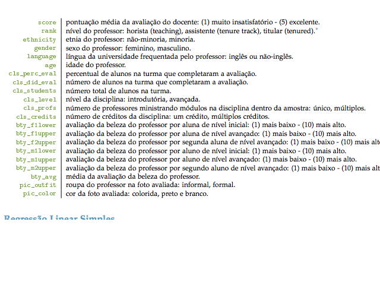

```{r}
library(ggplot2, quietly = T, warn.conflicts = F)
  library(dplyr, quietly = T, warn.conflicts = F)
```

#Descrição dos Dados
Os dados foram coletados a partir das avaliações discentes de final de semestre de uma grande amostra de professores da Universidade do Texas em Austin. Além disso, seis estudantes avaliaram a aparência física dos professores. O resultado é um banco de dados no qual cada linha contém diferentes disciplinas e cada coluna representa as variáveis sobre as disciplinas e os professores. 

Uma pequena amostra dos dados pode ser visualizada logo abaixo:

```{r}
      avaliacoes <- read.csv("evals.csv")
      head(avaliacoes)
```

Os nomes das colunas e suas, respectivas, descrições se encontram na figura abaixo.




#Análise dos dados

Vários cursos universitários dão aos alunos a oportunidade de avaliar o curso e o professor de maneira anônima ao final do semestre. Contudo, o uso das avaliações dos alunos como um indicador da qualidade do curso e a eficácia do ensino é frequentemente criticado porque essas medidas podem refletir a influência de características não relacionadas à docência, tal como a aparência física do professor. Na nossa nossa análise nós vamos tentar confirmar ou refutar se a o nivel de beleza do professor influ^encia na avaliaç~ao dos mesmo.

Antes de mais nada, nós precisamos verificar se, realmente, existe uma correlação entre o score que o professor recebeu 
e a média de sua beleza. Podemos fazer isso com o código abaixo:

```{r}
    cor.test(avaliacoes$score,avaliacoes$bty_avg)
```

O coeficiente de correlação indica a força e direção do relacionamento entre duas variáveis. Quanto mais próximo de zero mais é tal relacionamento. No nosso caso, podemos notar que existe sim uma correlação, porém é fraca. Afim de confirmar nossa afirmação, vamos criar uma regressão linear simples que tenta criar uma regressão para explicar os nossos dados.   

```{r}
  
    avaliacoes <- read.csv("evals.csv")
    beauty <- avaliacoes$bty_avg
    score <- avaliacoes$score

    data <- data.frame(x = score, y = beauty)
    rl <- lm(data = data, score ~ beauty)
    summary(rl)
    confint(rl)

```


Observando o valor do P-value, nós podemos descartar ou não a nossa hipótese nula. Nessa caso, nossa hipótese nula é que o coeficiente beta da beleza é igual à zero, ou seja, tal variável não tem nenhuma influência no score do professor. Como o nosso p-value é muito baixo nós podemos rejeitar tal hipótese. Porém, nós devemos olhar para o R-Quadrado a fim de verificar o quão bem a função representa os dados. Nessa caso, o R-Quadrado é muito baixo, ou seja, somente beauty não explica bem o score do professor.
Abaixo, nós podemos ver um gráfico com os dados e a função que foi gerada a partir da regressão:

```{r}
    ggplot(data, aes(y = score, x = beauty)) + 
    geom_point(colour = "blue", size = 4) + 
    theme_bw() + geom_smooth(method = "lm")
```


__Vamos encontrar um modelo que melhor explique o score do professor__

Observando as nossas variáveis, acredito que as melhores variáveis que explicam o score são:

Idade -  Acredito que professores mais novos tenham uma probabilidade maior de serem bem avaliados. 

Cor da Foto - Acredito que um professor com uma foto mais bonita tenha uma melhor avaliação e acho que um a foto colorida apresenta mais chances de ser considerada bonita.

Roupa do Professor - Acredito que pode ter alguma influência a forma como o professor se veste. Não sei ao certo se seria uma influência positiva ou negativa em cima da avaliação.

Nível da Disciplina - Acredito que professores de disciplinas mais fáceis tem mais chances de receberem uma melhor avaliação.

Sexo do Professor - Acredito que professores do sexo feminino apresentam uma maior chance de suas avaliações serem influências por variáveis que estão relacionadas à beleza, como por exemplo: Idade. 


A partir de tais hipóteses, nós podemos criar um modelo e verificar o quão bem, ou não, tais variáveis vão explicar o score do professor.

```{r}
       rl <- lm(avaliacoes$score ~ avaliacoes$age + avaliacoes$cls_level + avaliacoes$pic_color + avaliacoes$pic_outfit)
       summary(rl)
```

Observando o modelo acima, notamos que as variáveis que mais influênciam são idade e o tipo de foto (colorida ou preto-branco), pois o P-value delas é muito baixo em relação as demais. Assim sendo, vamos analisar o comportamento de uma regressão com apenas estas duas variáveis:

```{r}
      rl <- lm(avaliacoes$score ~ avaliacoes$age + avaliacoes$pic_color)      
      summary(rl)
```

Podemos perceber que tais variáveis apresentam uma pequena influência no score dos professores. Assim sendo, vamos adicionar o atributo da beleza do professor e observar o que acontece.

```{r}
      rl <- lm(avaliacoes$score ~ avaliacoes$age + avaliacoes$pic_color + avaliacoes$bty_avg)      
      summary(rl)
```
Nesse modelo é interessante observar que a idade não é significante pra esse modelo por causa do seu p-value não ser baixo o suficiente. Pra confirmar isso, podemos visualizar o intervalo de confiança dos coeficientes de cada variável no modelo.

```{r}
    rl <- lm(avaliacoes$score ~ avaliacoes$age + avaliacoes$pic_color + avaliacoes$bty_avg)      
    confint(rl)
```

Vemos que o intervalo de confiança do coeficiente da variável idade possui o zero dentro dele, ou seja, tal variável pode não ter influência nenhuma no score do professor __nesse modelo__, porém pode existir outras regressões em que isso não se repita.

#Female teachers vs Male teachers

A fim de procurar outros modelos que expliquem nossos dados, vamos didivir o mesmo no conjunto de professores e professoras e verificar como se comportam nossas variáveis.


__Female teachers__
```{r}
  
     female_teachers <- filter(avaliacoes, gender == "female")
     cor(female_teachers$score,female_teachers$age)
        
     rl <- lm(female_teachers$score ~ female_teachers$age + female_teachers$bty_avg + female_teachers$pic_color)
rl <- lm(female_teachers$score ~ female_teachers$age +  female_teachers$pic_color + female_teachers$pic_outfit + female_teachers$cls_level)
     summary(rl)

     ggplot(female_teachers, aes(y = score, x = age)) + 
    geom_point(colour = "blue", size = 4) + 
    theme_bw()

```

