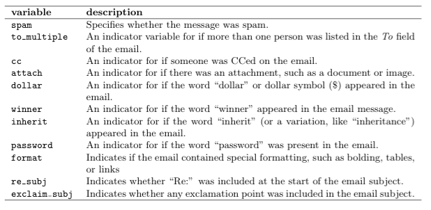

```{r}
library(ggplot2, quietly = T, warn.conflicts = F)
  library(dplyr, quietly = T, warn.conflicts = F)
```


#Descrição dos Dados
Nossos dados são referentes a um conjunto de emails classificados como spam ou não spam. Cada email do conjunto apresenta o seguinte conjunto de variáveis:



Uma pequena amostra dos nossos dados pode ser visualizada logo abaixo:

```{r}
  emails <- read.csv("email.csv")
  head(emails)
```

